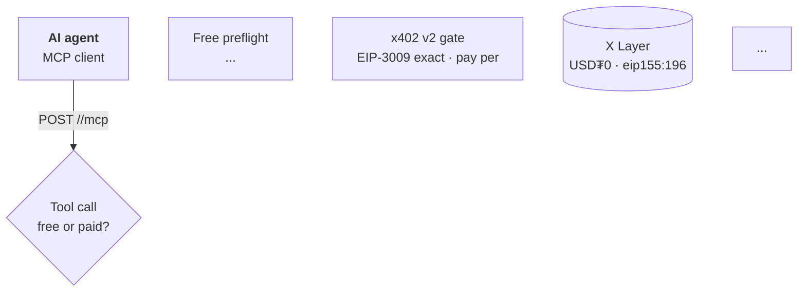

# EVIDIQ MCP Production Playbook — Complete Operational Guide

> **Purpose:** This document captures the EXACT end-to-end sequence used to ship EVIDIQ Bulwark (#15)
> from frozen PLAN.md to live OKX.AI listing. It is the canonical reference for any future MCP build.
> A fresh agent in a new tab reads this and follows it step-by-step for MCP #16+.
>
> **Source:** Compiled from the real Bulwark build session (2026-08-01). Every command, every gate,
> every fix is from actual execution — not theory.
>
> **Status:** FROZEN. This is the production playbook. Changes require explicit approval.

---

## Table of Contents

1. [Overview & Sequencing](#1-overview--sequencing)
2. [Prerequisites](#2-prerequisites)
3. [Phase 1: Build + Test (No x402)](#3-phase-1-build--test-no-x402)
4. [Phase 2: x402 Gate + Proven Paid Call](#4-phase-2-x402-gate--proven-paid-call)
5. [0G Storage Anchoring — Real Implementation](#5-0g-storage-anchoring--real-implementation)
6. [OKX.AI Registration](#6-okxai-registration)
7. [GitHub Repo Creation + Push](#7-github-repo-creation--push)
8. [Post-Registration Documentation](#8-post-registration-documentation)
9. [Landing Page: docs.ts + page.tsx + Hero SVG](#9-landing-page-docsts--pagetsx--hero-svg)
10. [Runbook + X402-Runbook Update](#10-runbook--x402-runbook-update)
11. [Architecture Mermaid Diagram](#11-architecture-mermaid-diagram)
12. [Verification Log (OpenClaw Terminal Proof)](#12-verification-log-openclaw-terminal-proof)
13. [Landing Rebuild + Deploy](#13-landing-rebuild--deploy)
14. [Final Commit + Push All Repos](#14-final-commit--push-all-repos)
15. [The 16 Defects (Carry-Forward Checklist)](#15-the-16-defects-carry-forward-checklist)
16. [Command Reference (copy-paste)](#16-command-reference-copy-paste)

---

## 1. Overview & Sequencing

```
PLAN.md frozen (design review approved)
    ↓
Phase 1: Build MCP, X402_BYPASS=1, deploy, test all tools, determinism
    ↓
Phase 2: Remove bypass, enable x402 gate, verify free 200 / paid 402
    ↓
onchainos payment quote (all 5 paid tools — OKX validator gate)
    ↓
Top-up test buyer wallet (onchainos wallet send)
    ↓
Real paid call → settle → receipt 0x1 (PROOF)
    ↓
Determinism re-verify (2× same input = same digest+sig)
    ↓
0G anchoring: fix mock→real SDK, verify zeroGAnchorTx returned
    ↓
OKX register: upload logo, validate-listing, create ASP+10 services, activate
    ↓                                          (get agent ID here)
GitHub: create repo, git init (NOT root .git!), push service code
    ↓
Post-reg docs: README (proven table, badge, registration table, arch, verif log)
    ↓
Landing: docs.ts entry, page.tsx, hero SVG
    ↓
Runbook: §24 registry row, §NN section, X402-runbook §13 proof row
    ↓
Landing rebuild + deploy (standalone output)
    ↓
Final commit + push all repos (root ops + landing + service)
    ↓
DONE. Fleet +1.
```

**Critical ordering rule:** Get agent ID from OKX registration BEFORE writing docs. Docs need the
real agent ID — writing docs before registration = rewriting them.

---

## 2. Prerequisites

### Environment
- VPS `hackaton-do` with `onchainos` at `/root/.local/bin/onchainos` (login shell only)
- VPS logged in as `evidiqdev@gmail.com` (seller wallet `0x2a8efe30…c9b0`)
- `web3.okx.com` reachable from VPS only (blocked on workstation)
- Seller wallet has USDT0 balance (for top-up transfers to test buyer)
- Test buyer wallet `0xd6B658dC6e53444bF9Cba598aFdd21Ede0A62Fb9` (key in `X402_SETTLE_KEY`)
- `GITHUB_TOKEN` in `Evidiq/.env.local` (for git push via credential helper)

### Source files ready
- `PLAN.md` frozen (design review approved, 17 sections + §0 defects)
- `server.ts` + `start-server.ts` + `skill.md` + `lib/` + `test/` + `Dockerfile` + `deploy/run.sh`
- `logo.png` (440×440 PNG, 1:1 square)
- `npm test` passes (33+ tests)
- `tsc --noEmit` clean

### Fleet reference (copy from these)
- `lib/x402/` — copy from newest sibling (Circuit/Aegis/Bulwark)
- `lib/og/` — copy from Sentinel/Notary (REAL 0G SDK, not mock)
- `deploy/run.sh` — template from any sibling (change NAME/PORT/prefix)
- `package.json` — `@0gfoundation/0g-ts-sdk` (NOT `0g-storage-ts-sdk`)

---

## 3. Phase 1: Build + Test (No x402)

### 3.1 Create env file on VPS

```bash
ssh hackaton-do 'signer_key=$(grep "^AEGIS_SIGNER_PRIVATE_KEY=" /root/evidiq-aegis.env | cut -d= -f2-)
okx_key=$(grep "^OKX_API_KEY=" /root/evidiq-aegis.env | cut -d= -f2-)
okx_secret=$(grep "^OKX_SECRET_KEY=" /root/evidiq-aegis.env | cut -d= -f2-)
okx_pass=$(grep "^OKX_PASSPHRASE=" /root/evidiq-aegis.env | cut -d= -f2-)
cat > /root/evidiq-<slug>.env <<EOF
PORT=3000
HOSTNAME=0.0.0.0
PUBLIC_BASE_URL=https://mcp.evidiq.dev/<slug>
<SLUG>_X402_BYPASS=1
<SLUG>_SIGNER_PRIVATE_KEY=${signer_key}
NODE_ENV=production
OKX_API_KEY=${okx_key}
OKX_SECRET_KEY=${okx_secret}
OKX_PASSPHRASE=${okx_pass}
OKX_BASE_URL=https://web3.okx.com
X402_CHAIN=eip155:196
X402_ASSET=0x779ded0c9e1022225f8e0630b35a9b54be713736
X402_PAY_TO=0x2a8efe3093278bb4bd3b2d9c7b5ba992ca4fc9b0
X402_DOMAIN_NAME=USD₮0
X402_DOMAIN_VERSION=1
X402_RPC=https://rpc.xlayer.tech
OG_PRIVATE_KEY=<from sibling env>
OG_STORAGE_RPC=https://evmrpc.0g.ai
OG_STORAGE_INDEXER=https://indexer-storage-turbo.0g.ai
EOF
chmod 600 /root/evidiq-<slug>.env'
```

**Key point:** Include X402 + OG vars from the start (even in Phase 1 bypass mode). Saves a
redeploy when switching to Phase 2.

### 3.2 Rsync source + build + deploy

```bash
cd /home/cucu/Coder/EVIDIQ/evidiq-<slug>-mcp
rsync -az --exclude node_modules --exclude dist --exclude .git --exclude .env -e ssh . hackaton-do:/root/evidiq-<slug>-src/
ssh hackaton-do 'cd /root/evidiq-<slug>-src && docker build -t evidiq-<slug>:latest . 2>&1 | tail -5'
ssh hackaton-do 'cd /root/evidiq-<slug>-src && bash deploy/run.sh'
```

**Defect #15:** `deploy/run.sh` MUST include `--env-file`. Without it, `signerAvailable:false`
and no OKX creds. Always use `run.sh`, never manual `docker run`.

### 3.3 Wait for health

```bash
ssh hackaton-do 'for i in 1 2 3 4 5 6 7 8 9 10; do sleep 2; s=$(docker inspect evidiq-<slug> --format "{{.State.Health.Status}}" 2>/dev/null); echo "t=${i}*2s status=$s"; [ "$s" = "healthy" ] && break; done'
```

### 3.4 Curl sweep (§14 step 3, §26-A-2 — HEAD must not hang)

```bash
# Endpoints
for p in /<slug>/health /<slug>/x402 /<slug>/skill.md; do
  printf "%-30s " "$p"
  curl -s -m 10 -o /dev/null -w "%{http_code} %{time_total}s\n" "https://mcp.evidiq.dev$p"
done

# HEAD /mcp (MUST answer explicitly, no hang — defect #14)
curl -s -m 10 -o /dev/null -w "HEAD %{http_code} %{time_total}s\n" -I "https://mcp.evidiq.dev/<slug>/mcp"

# GET /mcp
curl -s -m 10 -o /dev/null -w "GET  %{http_code} %{time_total}s\n" "https://mcp.evidiq.dev/<slug>/mcp"

# POST tools/list
curl -s -m 10 -o /dev/null -w "POST %{http_code} %{time_total}s\n" -X POST "https://mcp.evidiq.dev/<slug>/mcp" \
  -H "Content-Type: application/json" -H "Accept: application/json, text/event-stream" \
  -d '{"jsonrpc":"2.0","id":1,"method":"tools/list","params":{}}'
```

**Expected (Phase 1 bypass):** All 200, all <0.5s, no HANG.
**`/health` must show:** `"paymentGate":"bypassed","signerAvailable":true`

### 3.5 OpenClaw 10-tool test (all 200, no payment)

```bash
# Install MCP in OpenClaw on VPS
ssh hackaton-do 'openclaw mcp add evidiq-<slug> --transport streamable-http --url https://mcp.evidiq.dev/<slug>/mcp'
```

Test via direct MCP protocol (curl) — more reliable than `openclaw mcp call`:

```bash
MCP="https://mcp.evidiq.dev/<slug>/mcp"

# FREE TOOLS — expect all 200
for tool in <slug>_capabilities validate_<input> estimate_cost verify_<slug>_report get_artifact; do
  code=$(curl -s -m 20 -o /dev/null -w "%{http_code}" -X POST "$MCP" \
    -H "Content-Type: application/json" -H "Accept: application/json, text/event-stream" \
    -d "{\"jsonrpc\":\"2.0\",\"id\":1,\"method\":\"tools/call\",\"params\":{\"name\":\"$tool\",\"arguments\":{}}}")
  printf "%-26s http=%s\n" "$tool" "$code"
done

# PAID TOOLS (bypass mode — expect 200, not 402)
for tool in <paid_tool_1> <paid_tool_2> <paid_tool_3> <paid_tool_4> <paid_tool_5>; do
  code=$(curl -s -m 20 -o /dev/null -w "%{http_code}" -X POST "$MCP" \
    -H "Content-Type: application/json" -H "Accept: application/json, text/event-stream" \
    -d "{\"jsonrpc\":\"2.0\",\"id\":1,\"method\":\"tools/call\",\"params\":{\"name\":\"$tool\",\"arguments\":{}}}")
  printf "%-28s http=%s\n" "$tool" "$code"
done
```

**Defect #7 check:** `estimate_cost {toolName:"fake"}` → must return `known:false`, no invented price.
**Defect #5 check:** `verify_<slug>_report {}` → `valid:false` (NOT isError). `get_artifact {id:"x"}` → `found:false` (NOT isError).
**Defect #8 check:** `<slug>_capabilities.tools` list must match `tools/list` exactly (10/10).

### 3.6 Scan verdict verification

```bash
# Injection/malicious sample → must return BLOCK
# Clean sample → must return ALLOW
# Run each paid scan tool with both a malicious and clean input
```

### 3.7 Determinism test (RFC 6979)

```bash
MCP="https://mcp.evidiq.dev/<slug>/mcp"
BODY='{"jsonrpc":"2.0","id":1,"method":"tools/call","params":{"name":"attest_<slug>_safety","arguments":{"input":"<test payload>"}}} '
# Run 2× — save to files
curl -s -m 30 -X POST "$MCP" -H "Content-Type: application/json" -H "Accept: application/json, text/event-stream" -d "$BODY" | grep '^data:' | head -1 | sed 's/^data://' > /tmp/det1.json
curl -s -m 30 -X POST "$MCP" -H "Content-Type: application/json" -H "Accept: application/json, text/event-stream" -d "$BODY" | grep '^data:' | head -1 | sed 's/^data://' > /tmp/det2.json

# Compare digest + signature (must be IDENTICAL)
python3 << 'PYEOF'
import json
def extract(path):
    d=json.loads(open(path).read())
    j=json.loads(d['result']['content'][0]['text'])
    def find(obj,key):
        if isinstance(obj,dict):
            for k,v in obj.items():
                if k==key: return v
                r=find(v,key)
                if r: return r
        elif isinstance(obj,list):
            for i in obj:
                r=find(i,key)
                if r: return r
        return None
    return find(j,'reportDigest'), find(j,'signature'), find(j,'verdict')
dg1,sg1,v1=extract('/tmp/det1.json')
dg2,sg2,v2=extract('/tmp/det2.json')
print(f'DIGEST MATCH: {"YES" if dg1==dg2 else "NO"}')
print(f'SIG MATCH:    {"YES" if sg1==sg2 else "NO"}')
PYEOF
```

**Expected:** DIGEST MATCH: YES, SIG MATCH: YES.
**Note:** `executionId`, `evaluationTimeMs`, `timestamp`, `zeroG*` are excluded from digest (§17) — those WILL differ. The Digest + signature MUST be identical.

### 3.8 Capability diff (defect #8)

```bash
MCP="https://mcp.evidiq.dev/<slug>/mcp"
# tools/list
TL=$(curl -s -m 20 -X POST "$MCP" -H "Content-Type: application/json" -H "Accept: application/json, text/event-stream" -d '{"jsonrpc":"2.0","id":1,"method":"tools/list","params":{}}' | grep '^data:' | head -1 | sed 's/^data://' | python3 -c "import sys,json; d=json.load(sys.stdin); print(sorted([t['name'] for t in d['result']['tools']]))")
# capabilities
CAP=$(curl -s -m 20 -X POST "$MCP" -H "Content-Type: application/json" -H "Accept: application/json, text/event-stream" -d '{"jsonrpc":"2.0","id":1,"method":"tools/call","params":{"name":"<slug>_capabilities","arguments":{}}}' | grep '^data:' | head -1 | sed 's/^data://' | python3 -c "import sys,json; d=json.load(sys.stdin); j=json.loads(d['result']['content'][0]['text']); print(sorted(j.get('tools',[])))")
echo "tools/list: $TL"
echo "capabilities: $CAP"
echo "MATCH: $([ "$TL" = "$CAP" ] && echo YES || echo NO)"
```

**Expected:** MATCH: YES (10/10).

### 3.9 STOP GATE

**DO NOT register on OKX. DO NOT `agent activate`. DO NOT run a real paid call.**
README "Proven on-chain" stays `TODO`. Phase 2 is next.

---

## 4. Phase 2: x402 Gate + Proven Paid Call

### 4.1 Remove bypass, redeploy with full env

```bash
# Edit env on VPS: remove the BYPASS line
ssh hackaton-do 'sed -i "/BYPASS/d" /root/evidiq-<slug>.env'
# Verify bypass gone
ssh hackaton-do 'grep -c BYPASS /root/evidiq-<slug>.env'  # must be 0
# Verify X402 + OG present
ssh hackaton-do 'grep -c "X402_" /root/evidiq-<slug>.env; grep -c "OG_" /root/evidiq-<slug>.env'
# Redeploy
ssh hackaton-do 'cd /root/evidiq-<slug>-src && bash deploy/run.sh'
# Wait for health
ssh hackaton-do 'for i in 1 2 3 4 5; do sleep 2; s=$(docker inspect evidiq-<slug> --format "{{.State.Health.Status}}"); [ "$s" = "healthy" ] && break; done'
# Verify gate enforced
curl -s https://mcp.evidiq.dev/<slug>/health | python3 -c "import sys,json; d=json.load(sys.stdin); print('gate:',d.get('paymentGate'),'signer:',d.get('signerAvailable'))"
```

**Expected:** `gate: enforced, signer: true`

### 4.2 Free 200 / Paid 402 test

```bash
# FREE — expect all 200
for tool in <slug>_capabilities validate_<input> estimate_cost verify_<slug>_report get_artifact; do
  code=$(curl -s -m 20 -o /dev/null -w "%{http_code}" -X POST https://mcp.evidiq.dev/<slug>/mcp \
    -H "Content-Type: application/json" -H "Accept: application/json, text/event-stream" \
    -d "{\"jsonrpc\":\"2.0\",\"id\":1,\"method\":\"tools/call\",\"params\":{\"name\":\"$tool\",\"arguments\":{}}}")
  printf "%-26s http=%s\n" "$tool" "$code"
done

# PAID — expect all 402
for tool in <paid_tool_1> <paid_tool_2> <paid_tool_3> <paid_tool_4> <paid_tool_5>; do
  code=$(curl -s -m 20 -o /dev/null -w "%{http_code}" -X POST https://mcp.evidiq.dev/<slug>/mcp \
    -H "Content-Type: application/json" -H "Accept: application/json, text/event-stream" \
    -d "{\"jsonrpc\":\"2.0\",\"id\":1,\"method\":\"tools/call\",\"params\":{\"name\":\"$tool\",\"arguments\":{}}}")
  printf "%-28s http=%s\n" "$tool" "$code"
done

# HEAD /mcp — expect 402, no hang
curl -s -m 10 -o /dev/null -w "HEAD http=%{http_code} %{time_total}s\n" -I https://mcp.evidiq.dev/<slug>/mcp
```

### 4.3 §41-C challenge compliance

```bash
# Capture 402 response headers
curl -s -m 20 -D /tmp/hdr.txt -o /dev/null -X POST https://mcp.evidiq.dev/<slug>/mcp \
  -H "Content-Type: application/json" -H "Accept: application/json, text/event-stream" \
  -d '{"jsonrpc":"2.0","id":1,"method":"tools/call","params":{"name":"<paid_tool_1>","arguments":{}}}'

# WWW-Authenticate MUST be absent (§41-A trap)
grep -i "^www-authenticate" /tmp/hdr.txt && echo "BUG: WWW-Authenticate FOUND" || echo "OK: absent"

# payment-required + x-payment-required MUST be present
grep -iE "^(payment-required|x-payment-required):" /tmp/hdr.txt | head -2

# Decode challenge — verify §41-C structure
ch=$(grep -i "^payment-required:" /tmp/hdr.txt | head -1 | cut -d' ' -f2- | tr -d '\r')
python3 -c "
import base64,json
dec=json.loads(base64.b64decode('$ch'))
a=dec['accepts'][0]
print('x402Version:',dec.get('x402Version'))
print('scheme:',a.get('scheme'),'| network:',a.get('network'),'| asset:',a.get('asset'))
print('amount:',a.get('amount'),'| payTo:',a.get('payTo'),'| maxTimeout:',a.get('maxTimeoutSeconds'))
print('extra:',a.get('extra'))
ok = (dec.get('x402Version')==2 and a.get('scheme')=='exact'
      and a.get('network')=='eip155:196'
      and a.get('asset')=='0x779ded0c9e1022225f8e0630b35a9b54be713736'
      and a.get('payTo')=='0x2a8efe3093278bb4bd3b2d9c7b5ba992ca4fc9b0'
      and a.get('maxTimeoutSeconds')==300
      and a.get('extra')=={'name':'USD₮0','version':'1'})
print('§41-C:', 'YES' if ok else 'NO — MISMATCH')
"
```

### 4.4 OKX validator gate — payment quote all paid tools (§41-D, §27-A)

```bash
ssh hackaton-do 'bash -lc "for t in <paid_tool_1> <paid_tool_2> <paid_tool_3> <paid_tool_4> <paid_tool_5>; do printf \"%-30s \" \$t; onchainos payment quote https://mcp.evidiq.dev/<slug>/mcp --method POST --tool \$t 2>/dev/null | python3 -c \"import sys,json; d=json.load(sys.stdin); dc=d.get(\\\"data\\\",{}).get(\\\"decodedChallenge\\\",{}); print(\\\"ok=\\\"+str(d.get(\\\"ok\\\"))+\\\" amt=\\\"+str(dc.get(\\\"amount\\\"))+\\\" sup=\\\"+str(dc.get(\\\"supported\\\")))\" 2>/dev/null || echo ERR; done"'
```

**Expected:** ALL `ok=True, amt=<atomic>, sup=True`.
**If ANY returns `ok:false` or `unsupported`:** DO NOT proceed. Fix + redeploy before continuing.

### 4.5 Top-up test buyer wallet

Test buyer `0xd6B658dC6e53444bF9Cba598aFdd21Ede0A62Fb9` gets drained by paid calls.
Check balance + top-up:

```bash
# Check balance
ssh hackaton-do 'curl -s -X POST https://rpc.xlayer.tech -H "Content-Type: application/json" \
  -d "{\"jsonrpc\":\"2.0\",\"id\":1,\"method\":\"eth_call\",\"params\":[{\"to\":\"0x779ded0c9e1022225f8e0630b35a9b54be713736\",\"data\":\"0x70a08231000000000000000000000000d6b658dc6e53444bf9cba598afdd21ede0a62fb9\"},\"latest\"]}" \
  | python3 -c "import sys,json; r=json.load(sys.stdin)[\"result\"]; print(\"balance:\", int(r,16)/1e6, \"USDT0\")"'

# Top-up 0.05 USDT0 (enough for cheapest paid call 0.005 + attest 0.03)
ssh hackaton-do 'bash -lc "onchainos wallet send --recipient 0xd6B658dC6e53444bF9Cba598aFdd21Ede0A62Fb9 --chain 196 --readable-amount 0.05 --contract-token 0x779ded0c9e1022225f8e0630b35a9b54be713736 --force"'
```

**Note:** The `--recipient` flag (NOT `--to`). `--readable-amount` (NOT `--amt`).
`--contract-token` = USDT0 address. `--force` skips confirmation prompts.

### 4.6 Real paid call → settle → receipt 0x1

The test script needs `@okxweb3/x402-core` + `@okxweb3/x402-evm` + `viem` — these are in
the Circuit (or any sibling) Docker container. Docker cp the script + exec inside the container:

```bash
# Create test script on VPS
cat > /tmp/<slug>-pay-test.mjs << 'SCRIPT'
import { x402Client } from "@okxweb3/x402-core/client";
import { registerExactEvmScheme } from "@okxweb3/x402-evm/exact/client";
import { privateKeyToAccount } from "viem/accounts";

const TEST_PRIVATE_KEY = process.env.X402_SETTLE_KEY;
if (!TEST_PRIVATE_KEY) { console.error("Missing X402_SETTLE_KEY"); process.exit(1); }
const TARGET_URL = process.env.TARGET_URL || "https://mcp.evidiq.dev/<slug>/mcp";
const TOOL_NAME = process.env.TOOL_NAME || "<paid_tool_1>";

function getToolArgs(name) {
  // Per-tool test arguments — adapt for the service
  return { /* minimal valid input */ };
}

async function main() {
  console.log(`[1] Requesting 402 challenge from ${TARGET_URL} for ${TOOL_NAME}...`);
  const r1 = await fetch(TARGET_URL, {
    method: "POST",
    headers: { "Content-Type": "application/json", "Accept": "application/json, text/event-stream" },
    body: JSON.stringify({ jsonrpc: "2.0", id: 1, method: "tools/call", params: { name: TOOL_NAME, arguments: getToolArgs(TOOL_NAME) } }),
  });
  if (r1.status !== 402) { console.error(`Expected 402, got ${r1.status}`); process.exit(1); }
  const ph = r1.headers.get("payment-required") || r1.headers.get("x-payment-required");
  if (!ph) { console.error("Missing payment-required"); process.exit(1); }
  console.log(`[2] Challenge received (len: ${ph.length})`);
  const ch = JSON.parse(Buffer.from(ph, "base64").toString("utf-8"));
  console.log("Amount:", ch.accepts[0].amount, "PayTo:", ch.accepts[0].payTo.slice(0,12)+"...");

  const acc = privateKeyToAccount(TEST_PRIVATE_KEY);
  console.log(`Payer: ${acc.address}`);
  const client = new x402Client();
  registerExactEvmScheme(client, { signer: acc });
  console.log(`[3] Creating payment payload...`);
  const pp = await client.createPaymentPayload(ch);
  const b64 = Buffer.from(JSON.stringify(pp)).toString("base64");

  console.log(`[4] Sending paid request...`);
  const r2 = await fetch(TARGET_URL, {
    method: "POST",
    headers: { "Content-Type": "application/json", "Accept": "application/json, text/event-stream", "payment-signature": b64 },
    body: JSON.stringify({ jsonrpc: "2.0", id: 1, method: "tools/call", params: { name: TOOL_NAME, arguments: getToolArgs(TOOL_NAME) } }),
  });
  console.log(`Status: ${r2.status}`);
  const text = await r2.text();
  console.log(`Body (first 500): ${text.slice(0, 500)}`);

  const prh = r2.headers.get("payment-response");
  if (prh) {
    console.log(`\nPAYMENT-RESPONSE: ${prh}`);
    try {
      const decoded = JSON.parse(prh);
      console.log("Settle tx:", decoded.transaction || decoded.txHash);
      console.log("Settle status:", decoded.status);
    } catch(e) { console.log("(non-JSON, decode manually)"); }
  } else {
    console.log("\nNo PAYMENT-RESPONSE header");
  }
}
main().catch(err => { console.error("Failed:", err); process.exit(1); });
SCRIPT

# Copy script to Circuit container (has @okxweb3 deps)
ssh hackaton-do 'docker cp /tmp/<slug>-pay-test.mjs evidiq-circuit:/app/<slug>-pay-test.mjs'

# Run paid call — cheapest tool first (0.005 USDT0)
ssh hackaton-do 'export X402_SETTLE_KEY=$(grep "^X402_SETTLE_KEY=" /root/evidiq-circuit.env | cut -d= -f2-) && docker exec -e X402_SETTLE_KEY="$X402_SETTLE_KEY" -e TARGET_URL="https://mcp.evidiq.dev/<slug>/mcp" -e TOOL_NAME="<paid_tool_1>" evidiq-circuit node /app/<slug>-pay-test.mjs'
```

**Expected:** `Status: 200`, `PAYMENT-RESPONSE: {"status":"settled","transaction":"0x..."}`.

### 4.7 Verify settle receipt on-chain

```bash
# Extract full tx hash from PAYMENT-RESPONSE, then:
ssh hackaton-do 'curl -s -X POST https://rpc.xlayer.tech -H "Content-Type: application/json" \
  -d "{\"jsonrpc\":\"2.0\",\"id\":1,\"method\":\"eth_getTransactionReceipt\",\"params\":[\"<full_tx_hash>\"]}" \
  | python3 -c "
import sys,json
r=json.load(sys.stdin)[\"result\"]
print(\"tx:\", r[\"transactionHash\"])
print(\"status:\", r[\"status\"], \"(\"+ (\"SUCCESS 0x1\" if r[\"status\"]==\"0x1\" else \"FAILED\") +\")\")
print(\"from:\", r[\"from\"])
print(\"to:\", r[\"to\"])
"'
```

**Expected:** `status: 0x1 (SUCCESS)`. This is the PROOF. Record the tx hash.

### 4.8 Capture FULL settle tx hash

The `PAYMENT-RESPONSE` header may truncate in console. To get full hash:

```bash
ssh hackaton-do 'export X402_SETTLE_KEY=$(grep "^X402_SETTLE_KEY=" /root/evidiq-circuit.env | cut -d= -f2-) && docker exec -e X402_SETTLE_KEY="$X402_SETTLE_KEY" evidiq-circuit node -e "
(async () => {
  const { x402Client } = await import(\"@okxweb3/x402-core/client\");
  const { registerExactEvmScheme } = await import(\"@okxweb3/x402-evm/exact/client\");
  const { privateKeyToAccount } = await import(\"viem/accounts\");
  const r1 = await fetch(\"https://mcp.evidiq.dev/<slug>/mcp\", { method:\"POST\", headers:{\"Content-Type\":\"application/json\",\"Accept\":\"application/json, text/event-stream\"}, body: JSON.stringify({jsonrpc:\"2.0\",id:1,method:\"tools/call\",params:{name:\"<paid_tool_1>\",arguments:{<test_args>}}}) });
  const ch = JSON.parse(Buffer.from(r1.headers.get(\"payment-required\"),\"base64\").toString());
  const acc = privateKeyToAccount(process.env.X402_SETTLE_KEY);
  const c = new x402Client(); registerExactEvmScheme(c,{signer:acc});
  const pp = await c.createPaymentPayload(ch);
  const r2 = await fetch(\"https://mcp.evidiq.dev/<slug>/mcp\", { method:\"POST\", headers:{\"Content-Type\":\"application/json\",\"Accept\":\"application/json, text/event-stream\",\"payment-signature\":Buffer.from(JSON.stringify(pp)).toString(\"base64\")}, body: JSON.stringify({jsonrpc:\"2.0\",id:1,method:\"tools/call\",params:{name:\"<paid_tool_1>\",arguments:{<test_args>}}}) });
  console.log(\"status:\", r2.status);
  console.log(\"FULL PAYMENT-RESPONSE:\", r2.headers.get(\"payment-response\"));
})();
" 2>&1'
```

---

## 5. 0G Storage Anchoring — Real Implementation

### 5.1 The mock trap

Many EVIDIQ services shipped with a **mock** `lib/og/storage.ts` that returns fake root+tx from
string hashing. This is NOT real 0G anchoring. The real implementation exists in Sentinel/Notary.

### 5.2 Port real implementation from Sentinel

Check the service's `lib/og/storage.ts` — if it contains `mockRoot` or `mockTx`, it's fake.

**Package fix (defect):** `@0gfoundation/0g-storage-ts-sdk` is WRONG. Correct: `@0gfoundation/0g-ts-sdk`.

```json
// package.json optionalDependencies
"@0gfoundation/0g-ts-sdk": "^1.2.8",   // NOT 0g-storage-ts-sdk
"ethers": "6.13.1"
```

**config.ts** — copy from `evidiq-sentinel-mcp/lib/og/config.ts` verbatim (has `chainId`, `computeRpc`,
`normalizeKey` validation).

**storage.ts** — copy from `evidiq-sentinel-mcp/lib/og/storage.ts`. Key elements:
- `ZgFile.fromFilePath` (temp file → 0G file object)
- `Indexer` across candidate endpoints (turbo first, fallback standard)
- `indexer.upload(file, storageRpc, signer)` — real upload
- `extractRootTx(result)` — handle SDK version differences (`rootHash`/`rootHashes`, `txHash`/`txHashes`)
- 30s timeout (`UPLOAD_TIMEOUT_MS`) — never hangs a paid call
- `mkdtemp` + `rm` cleanup — temp dir per upload
- Filename: `evidiq-<slug>.json`

### 5.3 Rebuild + redeploy with fixed 0G

```bash
cd /home/cucu/Coder/EVIDIQ/evidiq-<slug>-mcp
npm install  # install correct @0gfoundation/0g-ts-sdk
npx tsc --noEmit  # verify clean
npm test  # verify tests still pass
rsync -az --exclude node_modules --exclude dist --exclude .git --exclude .env -e ssh . hackaton-do:/root/evidiq-<slug>-src/
ssh hackaton-do 'cd /root/evidiq-<slug>-src && docker build -t evidiq-<slug>:latest . && bash deploy/run.sh'
```

### 5.4 Verify 0G anchor (paid call with attest tool)

```bash
# Top-up if needed (attest usually costs 0.03 USDT0)
ssh hackaton-do 'bash -lc "onchainos wallet send --recipient 0xd6B658dC6e53444bF9Cba598aFdd21Ede0A62Fb9 --chain 196 --readable-amount 0.05 --contract-token 0x779ded0c9e1022225f8e0630b35a9b54be713736 --force"'

# Run attest paid call, check for zeroG fields in response
ssh hackaton-do 'export X402_SETTLE_KEY=$(grep "^X402_SETTLE_KEY=" /root/evidiq-circuit.env | cut -d= -f2-) && docker exec -e X402_SETTLE_KEY="$X402_SETTLE_KEY" -e TARGET_URL="https://mcp.evidiq.dev/<slug>/mcp" -e TOOL_NAME="attest_<slug>_safety" evidiq-circuit node /app/<slug>-pay-test.mjs'
```

Extract `zeroGAnchorTx` + `zeroGStorageRoot` from response:

```bash
# Parse response for 0G fields
python3 << 'PYEOF'
import json
d = json.loads(open('/tmp/attest-response.json').read())
j = json.loads(d['result']['content'][0]['text'])
r = j.get('report', {})
rc = r.get('receipt', {})
print('zeroGAnchorTx:', rc.get('zeroGAnchorTx', 'MISSING'))
print('zeroGStorageRoot:', rc.get('zeroGStorageRoot', 'MISSING'))
print('If MISSING: 0G not working. If hex: REAL 0G anchor SUCCESS.')
PYEOF
```

**Expected:** Real hex tx hash + hex merkle root (NOT undefined/missing).

### 5.5 Record both settle tx hashes

You now have TWO proven tx hashes:
1. `<paid_tool_1>` settle tx — the basic paid call proof
2. `attest_<slug>_safety` settle tx + `zeroGAnchorTx` + `zeroGStorageRoot` — the full proof

---

## 6. OKX.AI Registration

### 6.1 Pre-flight (already done this session)

`onchainos preflight --skill-version <version>` — must return `action: null`.

### 6.2 Prepare service JSON

Create `/tmp/<slug>-services.json` — 10 services, A2MCP type. Mirror the format from Aegis/Circuit.
Each service: `serviceName`, `serviceDescription` (3 lines: what it does / user provides / returns),
`serviceType: "A2MCP"`, `fee` (atomic string: "0.005" to "0.03" for paid, "0" for free),
`endpoint: "https://mcp.evidiq.dev/<slug>/mcp"`.

### 6.3 Upload avatar

```bash
scp /home/cucu/Coder/EVIDIQ/evidiq-<slug>-mcp/logo.png hackaton-do:/tmp/logo.png
ssh hackaton-do 'bash -lc "onchainos agent upload --file /tmp/logo.png"'
# Record the returned CDN URL
```

### 6.4 Validate-listing (QA gate)

```bash
ssh hackaton-do 'bash -lc "onchainos agent validate-listing --role asp --name \"EVIDIQ <Name>\" --description \"<full description>\" --service \"\$(< /tmp/<slug>-services.json)\""'
```

**Expected:** `{"pass": true, "findings": []}`. If findings, fix before create.

### 6.5 Create ASP + 10 services

```bash
ssh hackaton-do 'bash -lc "onchainos agent create --role asp --name \"EVIDIQ <Name>\" --description \"<full description>\" --picture <CDN_URL> --service \"\$(< /tmp/<slug>-services.json)\""'
```

**Record:** `newAgentId` (the agent ID — needed for ALL docs), `txHash` (registration tx).

### 6.6 Activate (submit for review)

```bash
ssh hackaton-do 'bash -lc "onchainos agent activate --agent-id <ID> --preferred-language en-US"'
```

**Read `submitApproval`** (NOT `activate.success`):
- `submitApproval: [{approvalStatus:2, success:true}]` = submitted, under review. STOP.
- `activate.success: false` is NORMAL — the submission itself succeeded via `submitApproval`.
- `approvalStatus: 2` = "Listing under review". **DO NOT POLL.**

### 6.7 Get communication address

```bash
ssh hackaton-do 'bash -lc "onchainos agent get-agents --agent-ids <ID>"' | python3 -c "
import sys,json
d=json.load(sys.stdin)['data'][0]
print('agentId:', d['agentId'])
print('name:', d['name'])
print('communicationAddress:', d.get('communicationAddress'))
print('approvalLabel:', d.get('approvalLabel'))
"
```

---

## 7. GitHub Repo Creation + Push

### 7.1 Create GitHub repo via API

```bash
token="$(grep '^GITHUB_TOKEN=' /home/cucu/Coder/EVIDIQ/Evidiq/.env.local | cut -d= -f2-)"
curl -s -X POST https://api.github.com/user/repos \
  -H "Authorization: token $token" \
  -H "Content-Type: application/json" \
  -d '{"name":"evidiq-<slug>-mcp","description":"<description>","private":false}'
```

### 7.2 CRITICAL: git init in service folder (defect #16)

**DEFECT #16:** A service folder inside the ops workspace root inherits the root `.git` (the
PRIVATE ops repo) when it doesn't have its own. Pushing then sends ops content (runbook, logos,
.kiro) to the PUBLIC service repo.

```bash
cd /home/cucu/Coder/EVIDIQ/evidiq-<slug>-mcp

# VERIFY: must return the service folder, NOT /home/cucu/Coder/EVIDIQ
git rev-parse --show-toplevel

# If no .git exists, INIT FRESH:
git init
git config user.email "evidiqdev@gmail.com"
git config user.name "EVIDIQ Dev"
git branch -m main
git add -A
git status --short  # VERIFY: only service files (server.ts, lib/, test/, etc.)
git remote add origin https://github.com/evidiq/evidiq-<slug>-mcp.git
```

### 7.3 Push (token helper — §3 rule)

```bash
token="$(grep '^GITHUB_TOKEN=' /home/cucu/Coder/EVIDIQ/Evidiq/.env.local | cut -d= -f2-)"
git commit -m "feat: EVIDIQ <Name> MCP #<N> — production release

<description>. 10 tools (5 paid + 5 free).
OKX.AI Agent #<ID> under review.
Proven paid call: <tool> <amount> USDT0 → settle <tx> 0x1."

GITHUB_TOKEN="$token" GIT_CONFIG_COUNT=1 \
  GIT_CONFIG_KEY_0=credential.helper \
  GIT_CONFIG_VALUE_0='!f() { echo "username=x-access-token"; echo "password=$GITHUB_TOKEN"; }; f' \
  git push -u origin main
```

### 7.4 If wrong content was pushed (force-push fix)

If GitHub shows ops files (runbook, logos) instead of service files:

```bash
cd /home/cucu/Coder/EVIDIQ/evidiq-<slug>-mcp
rm -rf .git  # remove inherited root .git
git init
git config user.email "evidiqdev@gmail.com"
git config user.name "EVIDIQ Dev"
git branch -m main
git add -A  # only service files now
git commit -m "feat: EVIDIQ <Name> MCP #<N> — production release"
git remote add origin https://github.com/evidiq/evidiq-<slug>-mcp.git
GITHUB_TOKEN="$token" ... git push --force -u origin main
```

### 7.5 Add to root .gitignore

```bash
# In /home/cucu/Coder/EVIDIQ/.gitignore, add:
/evidiq-<slug>-mcp/
```

---

## 8. Post-Registration Documentation

### 8.1 Service README — proven table

```markdown
## Proven on-chain

Live paid call against the deployed endpoint completed the full x402 v2 round trip through the official OKX facilitator:

| Tool | Amount | Settlement tx | Result |
|------|--------|---------------|--------|
| `<paid_tool_1>` | `0.005 USDT0` (`5000` atomic) | [`0x<hash>…<last6>`](https://www.oklink.com/xlayer/tx/<full_hash>) | `0x1` · verdict BLOCK · `reportDigest` reproducible (RFC 6979) |
| `attest_<slug>_safety` | `0.03 USDT0` (`30000` atomic) | [`0x<hash>…<last6>`](https://www.oklink.com/xlayer/tx/<full_hash>) | `0x1` · verdict BLOCK · `zeroGAnchorTx` `0x<hash>…` · `zeroGStorageRoot` `0x<hash>…` |
```

### 8.2 Service README — OKX badge

```markdown
<a href="https://www.okx.ai/agents/<ID>">%20Under%20Review-121212?style=flat-square&logo=okx&logoColor=white" alt="OKX.AI Agent <ID> listed" /></a>
```

### 8.3 Service README — launch status

```markdown
> **Launch status: live endpoint.** The MCP server is deployed at `https://mcp.evidiq.dev/<slug>/mcp`,
> paid calls settle through the official OKX Payment SDK, and the OKX.AI listing (**Agent #<ID>**) is
> submitted and under review. 0G Storage anchoring is live — `attest_<slug>_safety` returns a real
> `zeroGAnchorTx` + `zeroGStorageRoot`.
```

### 8.4 Service README — OKX registration table

```markdown
## OKX.AI Marketplace Registration

| Property | Value |
| :--- | :--- |
| **Agent ID** | `#<ID>` |
| **Agent Name** | `EVIDIQ <Name>` |
| **Listing Status** | `Listing under review` |
| **Registration Tx** | [`0x<hash>`](https://www.oklink.com/xlayer/tx/<full_hash>) |
| **OKX Agent URL** | [https://www.okx.ai/agents/<ID>](https://www.okx.ai/agents/<ID>) |
| **Communication Addr** | `0x<comms_addr>` |
| **Services Registered** | 10 Services (5 Gated: $0.005–$0.03, 5 Ungated: $0.00) |
```

### 8.5 Service README — verification log

```markdown
## Verification Log

All 10 tools tested via direct MCP protocol on VPS. Determinism verified (RFC 6979).

\```
Free Tools (HTTP 200)        Paid Tools (HTTP 402)
  <slug>_capabilities  → 200    <paid_1>  → 402
  validate_<input>      → 200    <paid_2>  → 402
  estimate_cost         → 200    <paid_3>  → 402
  verify_<slug>_report  → 200    <paid_4>  → 402
  get_artifact          → 200    <paid_5>  → 402

Determinism: reportDigest MATCH ✓  signature MATCH ✓
Capability diff: 10/10 MATCH ✓
On-chain: <paid_1> 0.005 → 0x<hash> 0x1 ✓
          attest 0.03 → 0x<hash> 0x1 ✓
          zeroGAnchorTx: 0x<hash> ✓
          zeroGStorageRoot: 0x<hash> ✓
\```
```

---

## 9. Landing Page: docs.ts + page.tsx + Hero SVG

### 9.1 docs.ts entry

Add to `Evidiq/lib/docs.ts` after the last service entry:

```typescript
  {
    slug: "<slug>",
    name: "EVIDIQ <Name>",
    tagline: "<tagline>",
    description: "<full description for docs hub card>",
    endpoint: "https://mcp.evidiq.dev/<slug>/mcp",
    badge: "Under OKX.AI review",
    badgeTone: "review",
    tools: [
      { name: "<paid_1>", paid: true },
      { name: "<paid_2>", paid: true },
      { name: "<paid_3>", paid: true },
      { name: "<paid_4>", paid: true },
      { name: "attest_<slug>_safety", paid: true },
      { name: "<slug>_capabilities", paid: false },
      { name: "validate_<input>", paid: false },
      { name: "estimate_cost", paid: false },
      { name: "verify_<slug>_report", paid: false },
      { name: "get_artifact", paid: false },
    ],
    href: "/docs/<slug>",
    image: "/docs/<slug>-hero.svg",
    okxUrl: "https://www.okx.ai/agents/<ID>",
    agentId: <ID>,
  },
```

### 9.2 page.tsx — copy from Bulwark/Circuit page.tsx as template

Create `Evidiq/app/docs/<slug>/page.tsx`. Mirror the structure:
- `metadata` (title, description, canonical, openGraph)
- `paidTools` array (5 tools with name/price/description)
- `freeTools` array (5 tools with name/description)
- `OkxAiLiveBlock` (status="review", url, agentId, name, endpoint)
- Quickstart section (curl commands)
- Use-cases grid
- Tools list (paid + free)
- Pipeline & invariants
- **x402 pricing table** (same table structure as Circuit)
- **"Settled on X Layer" emerald card** with tx links + 0G anchor info
- **"OpenClaw Verification Log" violet card** with terminal test output
- License section

### 9.3 Hero SVG

Create `Evidiq/public/docs/<slug>-hero.svg` (1200×750). Copy the Circuit/Bulwark template.
Change: title, gradient colors, center icon, card texts. Must be valid SVG.

### 9.4 tsc check

```bash
cd /home/cucu/Coder/EVIDIQ/Evidiq && npx tsc --noEmit
```

---

## 10. Runbook + X402-Runbook Update

### 10.1 §24 registry row

Add row to `EVIDIQ-RUNBOOK.md` §24 table:

```markdown
| <N> | <Name> | `evidiq-<slug>-mcp/` | <port> | #<ID> | under review |
```

Update "Next free host port" to `<port+1>`.

### 10.2 §NN section (new section after the last one)

Append a full section documenting the build:
- agentId, create tx hash
- Avatar CDN URL
- validate-listing result
- 10 services registered with fees
- activate result (submitApproval approvalStatus:2 success:true)
- Pre-submission gate summary (all green)
- Proven paid call: tx hash + receipt 0x1 + verdict
- Determinism verified
- 0G anchoring verified (zeroGAnchorTx + zeroGStorageRoot)
- Design review summary (if applicable)
- State line: "X Listed, 1 under review (#<ID> <Name>)"

### 10.3 X402-RUNBOOK §13 proof row

Add to the settlement table:

```markdown
| <Name> | #<ID> | `<paid_tool_1>` | `0.005 USDT0` | `0x<full_hash>` | under review |
```

---

## 11. Architecture Mermaid Diagram

Add `## Architecture` section to service README (before `## License`). Copy the Aegis/Bulwark
template. Adapt:
- `POST /<slug>/mcp` path
- Free tools list in the free node
- Gate description ("pay per <action>")
- Trust boundary subgraph: domain-specific pipeline steps
- classDef colors (same as fleet: client purple, payment green, core dark, output violet)



---

## 12. Verification Log (OpenClaw Terminal Proof)

Capture the terminal output from the test session. Format:

```
Free Tools (HTTP 200)
  <slug>_capabilities       → 200 ✓
  validate_<input>          → 200 ✓
  estimate_cost             → 200 ✓
  verify_<slug>_report      → 200 ✓
  get_artifact              → 200 ✓

Paid Tools (HTTP 402)
  <paid_1>                  → 402 ✓
  <paid_2>                  → 402 ✓
  ...

Scan Verdicts
  "<malicious input>"       → BLOCK ✓
  "<clean input>"           → ALLOW ✓
  ...

Determinism (RFC 6979)
  attest 2× same input → reportDigest MATCH ✓
  attest 2× same input → signature MATCH ✓

Capability Diff
  tools/list vs capabilities → 10/10 MATCH ✓

On-Chain Settlements
  <paid_1> 0.005 → 0x<hash>… 0x1 ✓
  attest 0.03   → 0x<hash>… 0x1 ✓
  zeroGAnchorTx: 0x<hash>… ✓
  zeroGStorageRoot: 0x<hash>… ✓
```

This goes into: (1) service README, (2) landing page violet card.

---

## 13. Landing Rebuild + Deploy

### 13.1 Git pull + build

```bash
ssh hackaton-do 'cd /root/evidiq-src && git fetch origin main && git reset --hard origin/main'
```

**Important:** The landing Dockerfile uses `output: "standalone"` (§26-G). Build should be ~40s
if `npm ci` is cached, ~10min if cache was pruned.

```bash
# Build in background (don't block)
ssh hackaton-do 'cd /root/evidiq-src && docker build -t evidiq:latest . > /tmp/landing-build.log 2>&1 &
echo "PID: $!"'

# Check progress
sleep 60 && ssh hackaton-do 'tail -3 /tmp/landing-build.log; ps aux | grep "docker build" | grep -v grep | wc -l'
# When build shows "DONE" and process count = 0, redeploy
```

### 13.2 Redeploy

```bash
ssh hackaton-do 'cd /root/evidiq-src && bash deploy/run.sh'
```

### 13.3 Verify new page live

```bash
ssh hackaton-do 'sleep 5; curl -s -m 10 http://127.0.0.1:3010/docs/<slug> | grep -oiE "<Name>|<ID>|Under OKX.AI review|Listed|Settled|Verification" | head -5'
# Also check hero SVG
curl -s -m 10 -o /dev/null -w "svg=%{http_code} type=%{content_type}\n" https://evidiq.dev/docs/<slug>-hero.svg
```

**If SVG 404 after deploy:** `docker restart evidiq` (Next.js reads new static files on restart).

### 13.4 Land build speed notes (§26-G)

- **Never `docker builder prune -f`** casually — clears `npm ci` cache (6GB+), next build = 10+ min
- **Safe prune:** `docker image prune -f` (dangling only, never touches build cache)
- **Standalone output:** `next.config.mjs` must have `output: "standalone"` — 1.9GB → 487MB image
- **Rebuild with cache:** `npm ci` stays cached, only `COPY . .` + `npm run build` rerun (~40s)

---

## 14. Final Commit + Push All Repos

### 14.1 Root ops repo (local, no remote)

```bash
cd /home/cucu/Coder/EVIDIQ
git add EVIDIQ-RUNBOOK.md EVIDIQ-X402-RUNBOOK.md README.md .gitignore
git commit -m "docs(<slug>): MCP #<N> registered as Agent #<ID> — shipped+proven+submitted

Two-phase build. Proven paid call: <tool> <amount> → settle <tx> 0x1.
§<NN> added. §24 registry row + X402-runbook §13 proof row added.
.gitignore: exclude evidiq-<slug>-mcp/ (has own public repo)."
```

### 14.2 Landing repo (push to GitHub)

```bash
cd /home/cucu/Coder/EVIDIQ/Evidiq
git add lib/docs.ts app/docs/<slug>/page.tsx public/docs/<slug>-hero.svg
git commit -m "feat(docs): add EVIDIQ <Name> (#<ID>) landing documentation

New /docs/<slug> page with OkxAiLiveBlock, 10-tool table, x402 pricing,
settle proof card, OpenClaw verification log, hero SVG.
docs.ts entry with agentId <ID>, badgeTone review."

token="$(grep '^GITHUB_TOKEN=' /home/cucu/Coder/EVIDIQ/Evidiq/.env.local | cut -d= -f2-)"
GITHUB_TOKEN="$token" GIT_CONFIG_COUNT=1 \
  GIT_CONFIG_KEY_0=credential.helper \
  GIT_CONFIG_VALUE_0='!f() { echo "username=x-access-token"; echo "password=$GITHUB_TOKEN"; }; f' \
  git push origin main
```

### 14.3 Service repo (push to GitHub)

```bash
cd /home/cucu/Coder/EVIDIQ/evidiq-<slug>-mcp
# CRITICAL: verify .git toplevel (defect #16)
git rev-parse --show-toplevel  # MUST be the service folder
git add -A
git commit -m "docs: <Name> #<ID> — proven on-chain, 0G live, architecture, verification log"
GITHUB_TOKEN="$token" ... git push origin main
```

### 14.4 Verify all pushes

```bash
# Each repo: local HEAD == remote HEAD
cd /home/cucu/Coder/EVIDIQ/Evidiq && git log --oneline -1  # compare with GitHub
cd /home/cucu/Coder/EVIDIQ/evidiq-<slug>-mcp && git log --oneline -1
# Root: local only
cd /home/cucu/Coder/EVIDIQ && git log --oneline -1
```

---

## 15. The 16 Defects (Carry-Forward Checklist)

Run this checklist mentally at EVERY step. The `security-audit` skill checks these automatically.

1. **Fallback signing key in source** — no `process.env.KEY || "0x..."` anywhere. Crash on missing.
2. **Claim derived from config, not check** — every claim traces to an executed trace step.
3. **Free tool erroring on `{}`** — capabilities/validate/estimate handle no-arg without throwing.
4. **Enum/regex in free-tool schema causing 402** — free tools accept `{}` or minimal valid input.
5. **"Not found" returned as error (isError)** — return normal result with "not found" message.
6. **Verdict about nothing** — BLOCK requires ≥1 BLOCK-action violation.
7. **`estimate_cost` inventing answers** — only quote tools in PAID_TOOLS + free ones.
8. **Capabilities describing half the service** — `*_capabilities.tools` == `tools/list` (diff before deploy).
9. **Stated capability with no implementation** — every tool in `tools/list` has a handler.
10. **Charging then rejecting input** — `validate_*` refuses what paid tools refuse.
11. **Detectors tested only in convenient form** — test through MCP transport, not just library.
12. **Model in deterministic hot path** — no model, no network, no random in verdict path.
13. **x402 header mistakes** — no `WWW-Authenticate`, `error` in JSON body only, `GET /mcp` = 402, `resource.url` from `PUBLIC_BASE_URL`.
14. **HEAD /mcp hang** — answer HEAD explicitly (402 with no body) before MCP handler.
15. **Container without env-file** — always deploy via `deploy/run.sh` (has `--env-file`).
16. **Wrong repo content on GitHub push** — `git rev-parse --show-toplevel` must be service folder, NOT ops root. `git init` if no `.git`.

---

## 16. Command Reference (copy-paste)

### Token helper push pattern (§3 — never put token in URL/config)
```bash
token="$(grep '^GITHUB_TOKEN=' /home/cucu/Coder/EVIDIQ/Evidiq/.env.local | cut -d= -f2-)"
GITHUB_TOKEN="$token" GIT_CONFIG_COUNT=1 \
  GIT_CONFIG_KEY_0=credential.helper \
  GIT_CONFIG_VALUE_0='!f() { echo "username=x-access-token"; echo "password=$GITHUB_TOKEN"; }; f' \
  git push origin main
```

### onchainos wallet send (top-up test buyer)
```bash
ssh hackaton-do 'bash -lc "onchainos wallet send --recipient 0xd6B658dC6e53444bF9Cba598aFdd21Ede0A62Fb9 --chain 196 --readable-amount 0.05 --contract-token 0x779ded0c9e1022225f8e0630b35a9b54be713736 --force"'
```

### onchainos payment quote (pre-submit gate)
```bash
ssh hackaton-do 'bash -lc "onchainos payment quote https://mcp.evidiq.dev/<slug>/mcp --method POST --tool <tool_name>"'
```

### eth_getTransactionReceipt (verify settle)
```bash
ssh hackaton-do 'curl -s -X POST https://rpc.xlayer.tech -H "Content-Type: application/json" \
  -d "{\"jsonrpc\":\"2.0\",\"id\":1,\"method\":\"eth_getTransactionReceipt\",\"params\":[\"<tx_hash>\"]}"'
```

### OKLink tx URL format
```
https://www.oklink.com/xlayer/tx/<full_hash>
```
**NEVER** `https://www.okx.com/explorer/xlayer/tx/...`

### Docker build speed
```bash
# Normal (npm ci cached) — ~40s
docker build -t evidiq-<slug>:latest .

# If COPY . . stale (file changed but cache not invalidated):
docker build --build-arg CACHEBUST=$(date +%s) -t evidiq-<slug>:latest .

# NEVER --no-cache unless you accept 10+ min rebuild
# NEVER docker builder prune -f unless disk critical
```

### Landing deploy (standalone, fast)
```bash
ssh hackaton-do 'cd /root/evidiq-src && git fetch origin main && git reset --hard origin/main'
# Build in background
ssh hackaton-do 'cd /root/evidiq-src && docker build -t evidiq:latest . > /tmp/landing-build.log 2>&1 &'
# Wait + check
sleep 60 && ssh hackaton-do 'tail -3 /tmp/landing-build.log; ps aux | grep "docker build" | grep -v grep | wc -l'
# When done:
ssh hackaton-do 'cd /root/evidiq-src && bash deploy/run.sh'
# If SVG 404: docker restart evidiq
```

---

## End of Playbook

This document is the complete operational reference for shipping an EVIDIQ MCP service.
A fresh agent in a new tab reads this top to bottom and follows it step by step.

**Frozen. Changes require explicit approval.**
