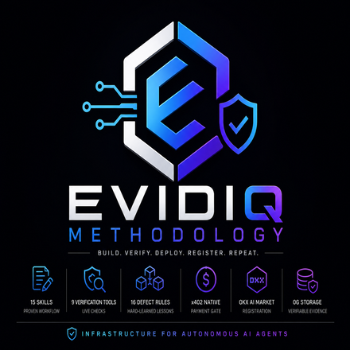
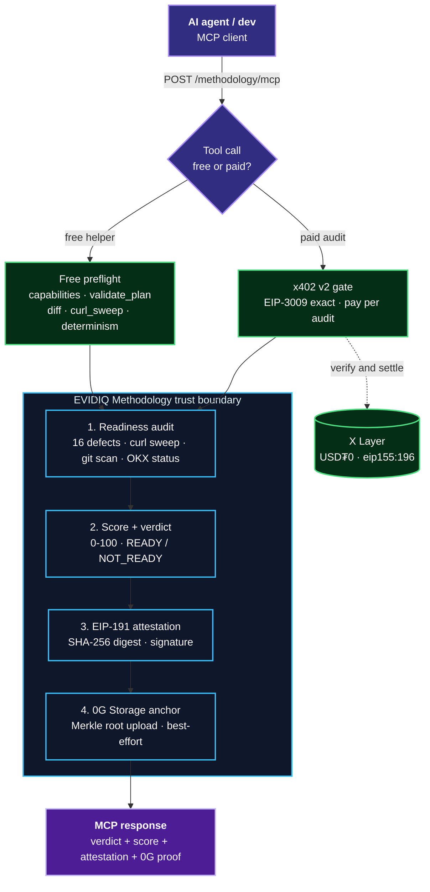

<p align="center">
  
</p>

<p align="center">
  <h1 align="center">EVIDIQ Methodology</h1>
</p>

<p align="center"><strong>Agentic MCP Fleet Production Framework &amp; Verification Tools</strong></p>

<p align="center">
  Battle-tested skills framework + verification MCP for building, testing, deploying, and registering
  x402-paid MCP services on OKX.AI. Specialized for the EVIDIQ fleet workflow (15 MCP services shipped,
  16 hard-won lessons).
</p>

<p align="center">
  <a href="https://evidiq.dev">evidiq.dev</a> &middot;
  <a href="https://mcp.evidiq.dev/methodology/skill.md">Agent Skill</a> &middot;
  <a href="https://github.com/evidiq/evidiq-methodology-mcp">Methodology MCP</a>
</p>

<p align="center">
  <a href="https://mcp.evidiq.dev/methodology/mcp"></a>
  <a href="https://www.oklink.com/xlayer"></a>
  <a href="https://mcp.evidiq.dev/methodology/x402"></a>
  <a href="https://web3.okx.com/onchainos/dev-docs/payments/service-seller-sdk"></a>
  <a href="https://www.okx.ai/agents/10389"></a>
  <a href="./LICENSE"></a>
</p>

---

**EVIDIQ Methodology is the specialized version.** It ships two things in one repo:

1. **`skills/`** — 15 markdown methodology skills that auto-trigger in any coding agent (spec → freeze → TDD → bypass-test → x402 gate → OKX register → docs sync)
2. **MCP server** — 15 tools (5 free, 10 paid) that verify MCP readiness: git history scan, x402 challenge validator, OKX status checker, production readiness score, and EIP-191 signed attestation with 0G Storage anchoring

> **Launch status: live endpoint.** The MCP server is deployed at `https://mcp.evidiq.dev/methodology/mcp`, paid calls settle through the official OKX Payment SDK, and the OKX.AI listing (**Agent #10389**) is submitted and under review. 0G Storage anchoring is live — `attest_readiness` returns a real `zeroGAnchorTx` + `zeroGStorageRoot`.

---

## What it does

- **Git History Audit** — Scans full commit history for leaked private keys, GitHub PATs, OKX credentials, and mnemonics. Defect #1 and #16 prevention.
- **x402 Challenge Validator** — Decodes base64 x402 v2 challenges and verifies §41-C compliance (x402Version, scheme, network, asset, payTo, maxTimeout, extra). Confirms WWW-Authenticate absence (§41-A trap).
- **OKX Status Checker** — Queries OKX.AI listing status (approvalLabel, approvalRemark, communicationAddress) for any agent.
- **Plan Freeze Validator** — Checks PLAN.md for §17 Contract Freeze, determinism contract, and all required normative sections.
- **Pre-Submit Check** — Combines curl sweep, capability diff, and x402 compliance into one go/no-go report before OKX submission.
- **Deployment Env Scanner** — Checks container environment: signer available? OKX creds present? Gate enforced? OG key loaded?
- **Production Readiness Score** — Scores an MCP service 0–100 against the 16 EVIDIQ defects checklist with live checks.
- **On-Chain Proof Verifier** — Verifies settlement transactions via `eth_getTransactionReceipt` on X Layer.
- **Runbook Entry Generator** — Generates §24 registry row + §NN section template from agent ID and registration tx hash.
- **Readiness Attestation** — Full audit + EIP-191 signed attestation + 0G Storage merkle root anchoring.
- **15 Methodology Skills** — Auto-triggering markdown skills for spec-brainstorming, plan-writing, TDD, phased-deployment, x402-verification, OKX-registration, documentation-sync, security-audit, and more.

---

## Route to Methodology when

Use Methodology **before submitting any MCP service to OKX.AI**: before running `agent activate`, before writing the README proof table, after deploying to verify the gate, and when auditing git history for leaked keys.

A natural chain: `curl_sweep` → `diff_capabilities` → `validate_x402_compliance` → `pre_submit_check` → `production_readiness_score` → `attest_readiness`.

---

## Proven on-chain

Live paid calls against the deployed endpoint completed the full x402 v2 round trip through the official OKX facilitator:

| Tool | Amount | Settlement tx | Result |
|------|--------|---------------|--------|
| `audit_git_history` | `0.005 USDT0` (`5000` atomic) | [`0xb08852dc…6a5b7a`](https://www.oklink.com/xlayer/tx/0xb08852dcde3682645ed2927fa5577cf4d15735672fe08f3909030a33b56a5b7a) | `0x1` · paid call settled · payment-response `status:settled` |
| `attest_readiness` | `0.03 USDT0` (`30000` atomic) | [`0xfc003a8e…2337cc`](https://www.oklink.com/xlayer/tx/0xfc003a8e30055c96659bd4bc4c5d0ccd6456b4c713d47bf578b795dd6e2337cc) | `0x1` · verdict READY · score 100 · `reportDigest` `0x13e22cee…` · `signature` `0xf2aee8af…` · **0G anchored**: `zeroGAnchorTx` [`0x6a05c1da…3defb`](https://scan.0g.ai/tx/0x6a05c1da8242ec93a8d3fbab46e2157a3a71dd2244697088d28a7bead8d3defb) (0G mainnet chain 16661, status `0x1`) · `zeroGStorageRoot` `0xa793d5fb…0850` |

---

## OKX.AI Marketplace Registration

| Property | Value |
| :--- | :--- |
| **Agent ID** | `#10389` |
| **Agent Name** | `EVIDIQ Methodology` |
| **Listing Status** | `Listing under review` |
| **Registration Tx** | [`0x94c99f39009a80a800541d5693a301487a81f227f8b12ad88af4517eca4cb3e3`](https://www.oklink.com/xlayer/tx/0x94c99f39009a80a800541d5693a301487a81f227f8b12ad88af4517eca4cb3e3) |
| **OKX Agent URL** | [https://www.okx.ai/agents/10389](https://www.okx.ai/agents/10389) |
| **Communication Addr** | `0x35EdD829714b79211b8530B4e1A9A3f49B6ae0C3` |
| **Services Registered** | 15 Services (10 Gated: $0.005–$0.03, 5 Ungated: $0.00) |

---

## Fifteen MCP tools

### Paid audit &amp; attestation tools

| Tool | USDT0 | Purpose |
|------|-------|---------|
| `audit_git_history` | `0.005` | Scan full git history for leaked keys (EVM 0x64hex, ghp_, OKX creds, mnemonics) + git toplevel check. |
| `check_okx_status` | `0.005` | Query OKX.AI listing status (approvalLabel, approvalRemark, communicationAddress). |
| `validate_x402_compliance` | `0.01` | Decode base64 x402 v2 challenge → §41-C field-by-field compliance check. |
| `validate_plan_freeze` | `0.01` | Verify PLAN.md has §17 Contract Freeze + determinism contract + all normative sections. |
| `pre_submit_check` | `0.015` | Combine curl sweep + capability diff + x402 compliance → go/no-go report. |
| `scan_deployment_env` | `0.02` | Check container env: signerAvailable, paymentGate, OKX creds, OG key presence. |
| `production_readiness_score` | `0.02` | Score 0–100 vs 16 EVIDIQ defects with live curl sweep + git scan + OKX status. |
| `verify_onchain_proof` | `0.02` | Verify settle tx via eth_getTransactionReceipt → status 0x1 confirmation. |
| `generate_runbook_entry` | `0.03` | Generate §24 registry row + §NN section template from agentId + txHash. |
| `attest_readiness` | `0.03` | Full audit + EIP-191 signed attestation + 0G Storage merkle root anchoring. |

### Free preflight and discovery tools

| Tool | Purpose |
|------|---------|
| `methodology_capabilities` | Catalog: 15 skills, 15 tools, 16 defects, pricing. |
| `validate_plan_sections` | Check PLAN.md has §0 defects + §17 freeze + two-phase scope. |
| `diff_capabilities` | Compare tools/list vs *_capabilities.tools (defect #8/#9). |
| `curl_sweep` | HEAD/GET/POST sweep with 10s timeout (defect #14 HEAD /mcp hang). |
| `verify_determinism` | Call free MCP tool 2× and deep-compare JSON responses. |

---

## Architecture



---

## Verification Log

All 15 tools tested via direct MCP protocol on VPS. Determinism verified. 0G anchoring live.

```
Free Tools (HTTP 200)
  methodology_capabilities       → 200 ✓
  validate_plan_sections         → 200 ✓
  diff_capabilities              → 200 ✓
  curl_sweep                     → 200 ✓
  verify_determinism             → 200 ✓

Paid Tools (HTTP 402)
  audit_git_history              → 402 ✓
  check_okx_status               → 402 ✓
  validate_x402_compliance       → 402 ✓
  validate_plan_freeze           → 402 ✓
  pre_submit_check               → 402 ✓
  scan_deployment_env            → 402 ✓
  production_readiness_score     → 402 ✓
  verify_onchain_proof           → 402 ✓
  generate_runbook_entry         → 402 ✓
  attest_readiness               → 402 ✓

HEAD /mcp → 402 · 0.07s (no hang) ✓

OKX Validator (payment quote — all 10 paid)
  audit_git_history              ok=True amt=5000 ✓
  check_okx_status               ok=True amt=5000 ✓
  validate_x402_compliance       ok=True amt=10000 ✓
  validate_plan_freeze           ok=True amt=10000 ✓
  pre_submit_check               ok=True amt=15000 ✓
  scan_deployment_env            ok=True amt=15000 ✓
  production_readiness_score     ok=True amt=20000 ✓
  verify_onchain_proof           ok=True amt=20000 ✓
  generate_runbook_entry         ok=True amt=30000 ✓
  attest_readiness               ok=True amt=30000 ✓

On-Chain Settlements
  audit_git_history 0.005 → 0xb08852dc… 0x1 ✓
  attest_readiness 0.03   → 0xfc003a8e… 0x1 ✓
  reportDigest: 0x13e22cee… ✓
  signature: 0xf2aee8af… ✓
  verdict: READY · score: 100 ✓
  zeroGAnchorTx: 0x6a05c1da… ✓
  zeroGStorageRoot: 0xa793d5fb… ✓
```

---

## Use it from any agent

```bash
# Read the public Skill document
curl -s https://mcp.evidiq.dev/methodology/skill.md

# Inspect current x402 pricing discovery
curl -s https://mcp.evidiq.dev/methodology/x402

# Connect remote MCP server (OpenClaw)
openclaw mcp add evidiq-methodology --transport streamable-http --url https://mcp.evidiq.dev/methodology/mcp

# Connect remote MCP server (Claude Code)
claude mcp add --transport http evidiq-methodology https://mcp.evidiq.dev/methodology/mcp
```

---

## Self-host

```bash
docker build -t evidiq-methodology:latest .
docker run -d --env-file .env -p 3016:3000 evidiq-methodology:latest
# Endpoint: http://localhost:3016/mcp
```

---

## Skills Library

The `skills/` directory contains 15 markdown methodology skills for the EVIDIQ fleet production workflow:

| Category | Skills |
|----------|--------|
| **Core Workflow** | spec-brainstorming, plan-writing, tdd-implementation, phased-deployment, x402-verification, okx-registration, documentation-sync, security-audit |
| **Meta** | subagent-driven-development, executing-plans, git-hygiene, writing-skills |
| **Debug** | systematic-debugging, verification-before-completion |
| **Bootstrap** | using-evidiq-methodology |

Each skill auto-triggers based on context. The skills are pure markdown — no runtime dependency on the MCP server, but the MCP tools provide live verification that the skills reference.

---

## License

EVIDIQ owns and licenses its original Methodology code under MIT. Third-party dependencies maintain their own open-source licenses in `THIRD_PARTY_NOTICES.md`.
